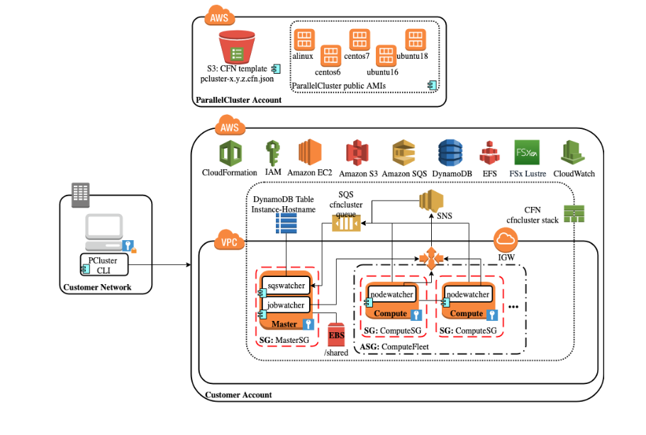

# High Performance Computing (HPC) - Intro

HPC is the ability to perform **parallel** data processing to **improve computing performance** and **perform complex calculations** at high speeds

It's popular applications include AI/ML, trend analysis, test simulation, etc

<p>&nbsp;</p>

## HPC typically has
- A cluster of co-located multi-node compute (CPU, GPU, RAM)
- High network bandwidth
- Shared storage
- job orchestration engine (scheduler)

<p>&nbsp;</p>

## HPC on Cloud v/s HPC on-premise

- on-demand, virtually infinite compute capacity
- Elasticity – scale up and down as required; pay only for what you use
- Choice of infrastructure (Spot, On-demand, Graviton, C5n)

<p>&nbsp;</p>

## Why ParallelCluster?

- Provides ease of HPC cluster provisioning and management (through text based configuration files)
- Provides automatic compute resource scaling (on-demand or spot)
- Automatic shared storage scaling (using EFS or FSx)
- Ease of migration from on-premise (slurm job scheduler)
- Ease of integration with other AWS services
- Open source

<p>&nbsp;</p>

## Architecture

- client (pcluster)
- head node
- compute node
- job scheduler
- EFS / FSx for Lusture (shared FS)


<p>&nbsp;</p>

## User Workflow 


<p>&nbsp;</p>

## Main Components

- job scheduler (slurm or awsbatch)
- head node
- compute nodes
- EFA
- EFS / FSx for Lusture (shared file system between master and compute nodes)

<p>&nbsp;</p>

## Other Components - clustermgtd (Slurm only)

- Syncs scheduler with EC2 status
- Static capacity management (ensure required number of EC2 are up)
- Unhealthy Amazon EC2 instances management
- Unhealthy Scheduler nodes management

<p>&nbsp;</p>

## Other Components - computemgtd (Slurm only)

- compute management daemon running on each compute node
- Syncs with head node every 5 mins
- Shuts down if it cannot reach head node

<p>&nbsp;</p>

## Other Components – nodewatcher (both slurm and awabatch)

- Runs on each node in the compute fleet
- monitors node and scales down if 
    - no job on instance for more than 10 mins (scaledown_idletime)
AND
    - no pending jobs 


<p>&nbsp;</p>

## Network Configuration

### VPC requirements
- DNS Resolution = yes
- DNS Hostnames = yes

<p>&nbsp;</p>

### Supported configurations
- One subnet for both head and compute nodes
- Two subnets, with the head node in one public subnet, and compute nodes in a private subnet (with NAT gateway)

[supported network configuration](https://docs.aws.amazon.com/parallelcluster/latest/ug/network-configuration-v3.html)

<p>&nbsp;</p>

### Supported capacity type
- On-demand
- Reserved
- Spot

<p>&nbsp;</p>

### Supported OS
- alinux2
- centos7/centos8
- ubuntu1604/1804

<p>&nbsp;</p>

## Job Schedulers

[Slurm](https://slurm.schedmd.com)



[awsbatch](https://aws.amazon.com/batch)


- pcluster CLI used to manage cluster
- Head node translates awsbsub commands to Batch APIs 
- Batch is responsible for provisioning capacity and running jobs
- Lambda and CodeBuild used for creating Docker image

<p>&nbsp;</p>

## ParallelCluster Install - requirements

- Linux/MacOS
- Python
- AWS CLI
- pip
- virtualenv (optional)

<p>&nbsp;</p>

## ParallelCluster Install - Lab

[Supported regions](https://docs.aws.amazon.com/parallelcluster/latest/ug/supported-regions.html)

<p>&nbsp;</p>

### High level steps
- Create a workstation (CloudFormation)
- Setup pre-req on workstation
- Install pcluster

<p>&nbsp;</p>

## CloudFormation template to create workstation

[template](workstation-cfn.yaml)


<p>&nbsp;</p>

## Installation of **pcluster** CLI on workstation

```
aws configure # set region only

sudo yum install python37 -y
curl -O https://bootstrap.pypa.io/get-pip.py
python3 get-pip.py
python3 -m pip install --upgrade pip
python3 -m pip install --user --upgrade virtualenv
python3 -m virtualenv ~/apc-ve


source ~/apc-ve/bin/activate      # needs to be performed in every new session

python3 -m pip install --upgrade "aws-parallelcluster"
(apc-ve) [root@ip-172-31-4-74 ~]# pcluster version
{
"version": "3.3.1"
}
# Node.js installation – required by CDKcurl -o- https://raw.githubusercontent.com/nvm-sh/nvm/v0.38.0/install.sh | bash
chmod ug+x ~/.nvm/nvm.sh
source ~/.nvm/nvm.sh # needs to be performed in every new session
# nvm install --lts
nvm install --lts=Gallium # fixes "Unable to check Node.js version" error
node --version


## Set up ~/.bash_profile

echo "source ~/apc-ve/bin/activate" >> ~/.bash_profile
echo "source ~/.nvm/nvm.sh" >> ~/.bash_profile
echo "nvm install --lts=Gallium 2>&1 >/dev/null" >> ~/.bash_profile

```

<p>&nbsp;</p>

## pcluster CLI – sub-commands

```
list-clusters       	    	Retrieve the list of existing clusters.
create-cluster      	    	Create a managed cluster in a given region.
delete-cluster      	    	Initiate the deletion of a cluster.
describe-cluster    	    	Get detailed information about an existing cluster.
update-cluster      	    	Update a cluster managed in a given region.
describe-compute-fleet        	Describe the status of the compute fleet.
update-compute-fleet          	Update the status of the cluster compute fleet.
delete-cluster-instances      	Initiate the forced termination of all cluster 			compute nodes. Does not work with AWS Batch 			clusters.
describe-cluster-instances    	Describe the instances belonging to a given 			cluster.
list-cluster-log-streams      	Retrieve the list of log streams associated with a 			cluster.
get-cluster-log-events	Retrieve the events associated with a log stream.
get-cluster-stack-events	Retrieve the events associated with the stack for a 			given cluster.
list-images         		Retrieve the list of existing custom images.
build-image         		Create a custom ParallelCluster image in a given 			region.
delete-image        		Initiate the deletion of the custom ParallelCluster 			image.
describe-image      		Get detailed information about an existing image.
list-image-log-streams 	Retrieve the list of log streams associated with an 			image.
get-image-log-events  	Retrieve the events associated with an image build.
get-image-stack-events    	Retrieve the events associated with the stack for a 			given image build.
list-official-images 		List Official ParallelCluster AMIs.
configure           		Start the AWS ParallelCluster configuration.
dcv-connect         		Permits to connect to the head node through an 			interactive session by using NICE DCV.
export-cluster-logs 		Export the logs of the cluster to a local tar.gz 			archive by passing through an Amazon S3 Bucket.
export-image-logs   		Export the logs of the image builder stack to a 			local tar.gz archive by passing through an Amazon 			S3 Bucket.
ssh                 		Connects to the head node instance using SSH.
version           	  	Displays the version of AWS ParallelCluster.

```

<p>&nbsp;</p>

## pcluster configure (awsbatch) - Lab

```
pcluster configure --config cluster-config-awsbatch.yaml
AWS Region ID [us-east-1]: 
EC2 Key Pair Name: [Set desired]
Scheduler [slurm]: 2
Head node instance type [t2.micro]: t2.medium
Name of queue 1 [queue1]: 
Maximum vCPU [10]: 
Automate VPC creation? (y/n) [n]: n
Allowed values for VPC ID: [Choose desired]
Automate Subnet creation? (y/n) [y]: n
head node subnet ID: [Choose desired]
compute subnet ID: [Choose desired]

Configuration file written to cluster-config-awsbatch.yaml
You can edit your configuration file or simply run 'pcluster create-cluster --cluster-configuration cluster-config-awsbatch.yaml --cluster-name cluster-name --region us-east-1' to create your cluster.

Copy SSH key to jump box and chmod 400

```

<p>&nbsp;</p>

## Review the created Cluster configuration file

[Cluster configuration file](https://docs.aws.amazon.com/parallelcluster/latest/ug/cluster-configuration-file-v3.html)

<p>&nbsp;</p>


## pcluster create-cluster (awsbatch) - Lab

```
pcluster create-cluster --cluster-configuration cluster-config-awsbatch.yaml --cluster-name cluster-name --region us-east-1
```

```
{
  "cluster": {
    "clusterName": "cluster-name",
    "cloudformationStackStatus": "CREATE_IN_PROGRESS",
    "cloudformationStackArn": "arn:aws:cloudformation:us-east-1:419264005465:stack/cluster-name/ca529720-79c2-11ed-9fb1-0e23c4409c71",
    "region": "us-east-1",
    "version": "3.3.1",
    "clusterStatus": "CREATE_IN_PROGRESS",
    "scheduler": {
      "type": "awsbatch"
    }
  }
}
```

```
pcluster list-clusters

pcluster describe-cluster -n cluster-name
```

<p>&nbsp;</p>

## What happened behind the scenes?

#### pcluster created several resources through CloudFormation, some of which are
- HeadNode
- ECR repo
- code build project (which built a Docker image and pushed it to ECR repo)
- managed Batch CE
- job queue
- ECS cluster
- a standard job def
- CW log group

<p>&nbsp;</p>

#### Inspect below in console
- CFN stacks (child stacks)
- Tags on head node
- Head node UserData
- Batch CE
- Job Queue
- Job Definition 
- CW log group

<p>&nbsp;</p>

#### pcluster CLI logs

```
cat ~/.parallelcluster/pcluster-cli.log

```

```
cat ~/.parallelcluster/config
```

<p>&nbsp;</p>

## Connect to HeadNode and submit you first job

From bastion
```
pcluster ssh -n cluster-name -i key.pem 

cat /etc/parallelcluster/cfnconfig

awsbqueues

```

From head node
```
awsbsub -jn get-instanceid -c cluster-name -p 2 -m 1024 curl 169.254.169.254/latest/meta-data/instance-id
awsbstat -s ALL
awsbstat 0127e786-34ae-438a-ab00-1db6540c6f95
awsbstat -s SUCCEEDED
awsbstat -d 
awsbhosts
awsbout 0127e786-34ae-438a-ab00-1db6540c6f95
awsbkill
awsbqueues
```

<p>&nbsp;</p>

### What happened behind the scenes?

- HeadNode performed `SubmitJob` API
- Batch performed `CreateAutoScalingGroup`, `RegisterTaskDefinition`, `RunTask` APIs
- Autoscaling performed `RunInstances` API call to launch a new ECS instance which ran the task


<p>&nbsp;</p>

## pcluster configure (slurm) - Lab

```
pcluster configure --config cluster-config.yaml
```

```
AWS Region ID [us-east-1]: 
EC2 Key Pair Name: [Set desired]
Scheduler [slurm]:
Operating System [alinux2]:
Head node instance type [t2.micro]: t2.medium
Number of queues [1]: 
Name of queue 1 [queue1]: 
Number of compute resources for queue1 [1]:
Compute instance type for compute resource 1 in queue1 [t2.micro]: t2.medium
Maximum instance count [10]:
Automate VPC creation? (y/n) [n]:
Allowed values for VPC ID: [Choose desired]
Automate Subnet creation? (y/n) [y]: n
head node subnet ID: [Choose desired]
compute subnet ID: [Choose desired]

Configuration file written to cluster-config.yaml
You can edit your configuration file or simply run 'pcluster create-cluster --cluster-configuration cluster-config.yaml --cluster-name cluster-name --region us-east-1' to create your cluster.
```

<p>&nbsp;</p>

## Customize Cluster configuration file

### Add CustomAmi 
[CustomAmi](https://docs.aws.amazon.com/parallelcluster/latest/ug/Scheduling-v3.html)

```
Region: us-east-1
Image:
  Os: alinux2
  # CustomAmi: ami-0dcc8a13b6f04b678
HeadNode:
  InstanceType: t2.medium
  Networking:
    SubnetId: subnet-bfbc419e
  Ssh:
    KeyName: useast1
  Iam:
    S3Access:
    - BucketName: mytestbucket123-qwerty
      EnableWriteAccess: false
Scheduling:
  Scheduler: slurm
  SlurmQueues:
  - Name: queue1
    ComputeResources:
    - Name: t2medium
      Instances:
      - InstanceType: t2.medium
      MinCount: 0
      MaxCount: 10
    Networking:
      SubnetIds:
      - subnet-4980bb77
    CapacityType: ONDEMAND
    ComputeSettings:
      LocalStorage:
        RootVolume:
          Size: 50
          VolumeType: gp2
          Encrypted: true
    Image:
      CustomAmi: ami-0dcc8a13b6f04b678
Monitoring:
  Logs:
    CloudWatch:
      Enabled: true
      RetentionInDays: 7
      DeletionPolicy: Retain
```

<p>&nbsp;</p>

## pcluster create-cluster (slurm) - Lab

```
pcluster create-cluster --cluster-configuration cluster-config-slurm.yaml --cluster-name slurm --region us-east-1
```

```
{
  "cluster": {
    "clusterName": "slurm",
    "cloudformationStackStatus": "CREATE_IN_PROGRESS",
    "cloudformationStackArn": "arn:aws:cloudformation:us-east-1:419264005465:stack/slurm/61d55f50-7d07-11ed-a3a2-125587893d59",
    "region": "us-east-1",
    "version": "3.3.1",
    "clusterStatus": "CREATE_IN_PROGRESS",
    "scheduler": {
      "type": "slurm"
    }
  }
}

```

<p>&nbsp;</p>


## What happened behind the scenes?

pcluster created several resources through CloudFormation, some of which are
- Compute and HeadNode LT
- Compute and HeadNode instance profile
- HeadNode instance
- DynamoDB table (used to keep state of cluster ex provisioned compute nodes)
- R53 hosted zone (for resolving compute node names)
- CW log group

Inspect below in console
- Tags on head node
- CW log group

<p>&nbsp;</p>


## Slurm CLI

```
Job submission
salloc - obtain a job allocation
sbatch - submit a batch script for later execution
srun - obtain a job allocation and execute an application 

Accounting
sacct - display accounting data
sacctmgr - view and modify account info
sbcast - transfer file to a job's compute node

Job Management
scancel - signal a job
squeue - view information about jobs
sinfo - view information about nodes and partitions
scontrol - view/modify configuration

Daemons
slurmctld - runs on head node
slurmd - runs on compute node
slurmdbd - manages slurm's DB of resource limits, licenses, accounting records etc

```

<p>&nbsp;</p>

## Connect to HeadNode and submit you first job

From bastion
```
pcluster ssh -n cluster-name -i key.pem 
```

From head node
```
sinfo
sinfo -vvv
```

```
cat > hello.sh <<EOF
#!/bin/bash
curl –s 169.254.169.254/latest/meta-data/instance-id
EOF
```

```
sbatch hello.sh
cat slurm-1.out
squeue –t all
scancel <job-id>
scontrol show jobid=9
```

<p>&nbsp;</p>


## What happened behind the scenes?

Inspect logs under 
`/var/log/parallelcluster/`
`/var/log/slurmctld.log`
`/var/log/cfn-init-cmd.log`
`/var/log/cfn-init.log`
`/var/log/chef-client.log`

Inspect below in console
- Compute and HeadNode LT
- Compute and HeadNode instance profile
- HeadNode instance
- DynamoDB table (used to keep state of cluster ex provisioned compute nodes)
- R53 hosted zone
- CW log group

<p>&nbsp;</p>


## awsbatch - MPI job in a multi-node parallel

MPI - Message Passing Interface (used in parallel programming)

[tutorial](https://docs.aws.amazon.com/parallelcluster/latest/ug/tutorials_03_batch_mpi.html)
<p>&nbsp;</p>

## Multiple queue model

[tutorial](https://docs.aws.amazon.com/parallelcluster/latest/ug/multi-queue-tutorial-v3.html)

<p>&nbsp;</p>

## Customizing head and compute nodes


### Custom AMI support

```
pcluster list-official-images
```

```
pcluster build-image ..
```

[building custom AMI](https://docs.aws.amazon.com/parallelcluster/latest/ug/building-custom-ami-v3.html)

[image builder configuration file](https://docs.aws.amazon.com/parallelcluster/latest/ug/image-builder-configuration-file-v3.html)

<p>&nbsp;</p>

### Custom pre and post install scripts (CustomActions)

[CustomActions](https://docs.aws.amazon.com/parallelcluster/latest/ug/custom-bootstrap-actions-v3.html]

<p>&nbsp;</p>

## Logging and Monitoring

[CloudWatch Dashboards](https://docs.aws.amazon.com/parallelcluster/latest/ug/cloudwatch-dashboard.html)

[CloudWatch Logs](https://docs.aws.amazon.com/parallelcluster/latest/ug/cloudwatch-logs-v3.html)

<p>&nbsp;</p>

## AMI patching

```
pcluster list-official-images

# update image in config file

# Stop compute fleet
pcluster update-compute-fleet-status --status STOP_REQUESTED

# Update
pcluster update-cluster --cluster-configuration <config> --cluster-name  <cluster>
```

<p>&nbsp;</p>

## Troubleshooting
[Troubleshooting](https://docs.aws.amazon.com/parallelcluster/latest/ug/troubleshooting-v3.html)

**There is no K2 for PC**

### Tools of trade

- CFN
- Batch
- ECS
- CloudTrail
- EC2 Cust

<p>&nbsp;</p>

## Best Practices

[PC best practices](https://github.com/aws/aws-parallelcluster/wiki/Best-Practices)

<p>&nbsp;</p>

## Out of scope
- code troubleshooting
- code support
- only infrastructure is supported