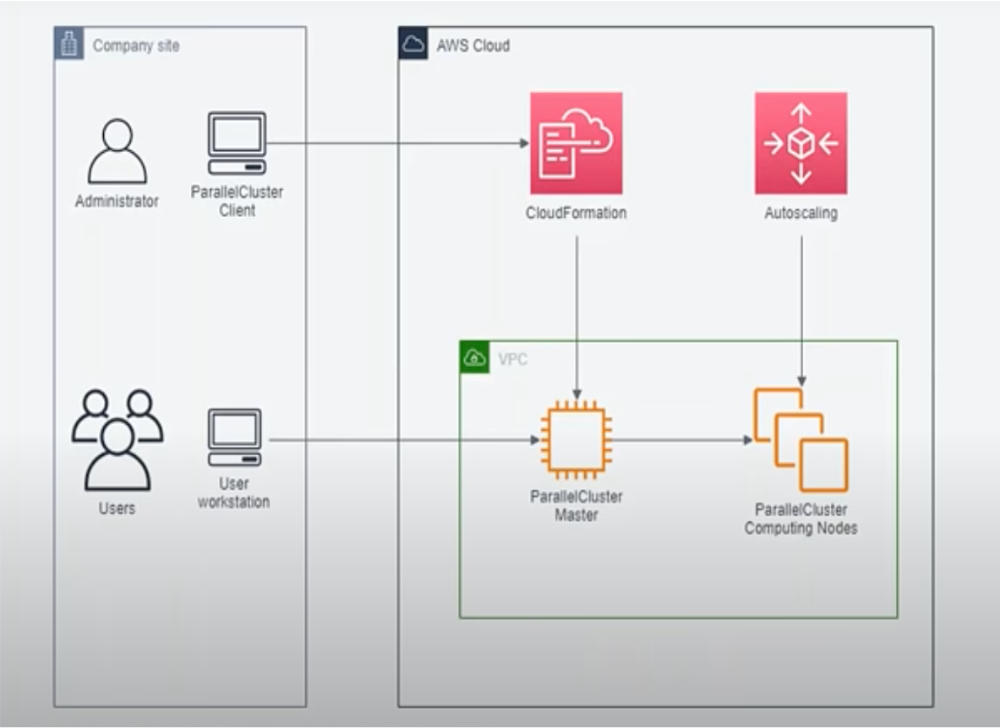

**High Performance Computing (HPC) - Intro**

HPC is the ability to perform **parallel** data processing to improve computing performance and perform complex calculations at high speeds

It's popular applications include AI/ML, trend analysis, test simulation, etc

HPC typically has
- A cluster of co-located multi-node compute (CPU, GPU, RAM)
- High network bandwidth
- Shared storage
- job orchestration engine (scheduler)

&nbsp;

**HPC on Cloud v/s HPC on-premise**

- on-demand, virtually infinite compute capacity
- Elasticity – scale up and down as required; pay only for what you use
- Choice of infrastructure (Spot, On-demand, Graviton, C5n)

&nbsp;

**Why ParallelCluster?**

- Provides ease of HPC cluster provisioning and management (through text based configuration files)
- Provides automatic compute resource scaling (on-demand or spot)
- Automatic shared storage scaling (using EFS or FSx)
- Ease of migration from on-premise (slurm job scheduler)
- Ease of integration with other AWS services
- Open source

&nbsp;

**Architecture**

- client (pcluster)
- head node
- compute node
- job scheduler
- EFS / FSx for Lusture (shared FS)

&nbsp;

**Out of scope**
- code troubleshooting
- code support
- only infrastructure is supported

&nbsp;
